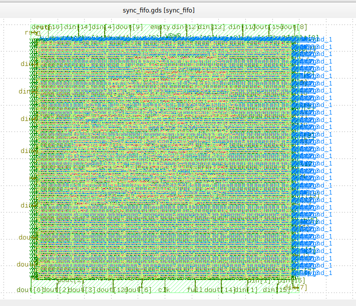

# Synchronous FIFO — RTL to GDSII

A parameterized synchronous FIFO (depth=8, width=16) implemented through **two complete physical design flows**: FPGA (Xilinx Vivado) and ASIC (OpenLane + SkyWater 130nm PDK). Same RTL, two silicon targets — built to understand how physical implementation differs between reconfigurable and custom silicon.

## Project Structure

```
synchronous-fifo/
├── rtl/
│   └── sync_fifo.v                  # Core design (simulation-only constructs removed for ASIC synthesis)
├── testbench/
│   └── sync_fifo_tb.v               # Self-checking testbench
├── fpga/
│   ├── constraints.xdc              # Clock + DRC severity constraints
│   └── reports/
│       ├── utilization_synth.rpt
│       └── timing_summary.rpt
├── asic/
│   ├── config.json                  # OpenLane flow configuration
│   └── reports/
│       ├── synthesis_stat.rpt       # Cell-level breakdown (sky130 standard cells)
│       ├── lvs_report.rpt
│       └── drc_report.txt
└── docs/
    └── fpga_vs_asic_comparison.md
```

## FPGA Flow (Xilinx Vivado, target: xc7a12ticsg325-1L)

Full implementation flow: synthesis → floorplanning → placement → clock tree synthesis → routing → bitstream generation.

**Resource Utilization:**
| Resource | Used | Available | Utilization |
|---|---|---|---|
| LUT | 24 | 8,000 | 0.30% |
| FF | 26 | 16,000 | 0.16% |
| IO | 38 | 150 | 25.33% |

**Timing Closure (10ns / 100MHz target… see note below):**
| Metric | Result |
|---|---|
| Worst Negative Slack (WNS) | 16.849 ns — all constraints met |
| Worst Hold Slack (WHS) | 0.085 ns — all constraints met |
| Worst Pulse Width Slack (WPWS) | 8.750 ns — all constraints met |
| Estimated Fmax | ~317 MHz (derived from critical path delay) |

The `fifo` memory array (8×16 = 128 bits) was automatically mapped to **3× RAM32M distributed RAM primitives** rather than discrete flip-flops — a resource-efficient choice by the Vivado synthesis engine, since distributed RAM uses otherwise-idle LUT fabric instead of consuming scarce Block RAM.

**Debugging highlight:** the original `full`/`empty` logic compared data *values* (`fifo[0] != 0`), which fails whenever a written value happens to be `0x0000`. Corrected to standard pointer-comparison logic:
```verilog
assign full  = (wptr == rptr - 1);
assign empty = (wptr == rptr);
```



## ASIC Flow (OpenLane, PDK: sky130A, standard cell lib: sky130_fd_sc_hd)

Full flow run through synthesis, floorplanning, placement, CTS, routing, and sign-off, targeting a 10ns (100MHz) clock.

**Synthesis Result:**
| Metric | Result |
|---|---|
| Total standard cells | 597 |
| Flip-flops (dfxtp_2) | 154 |
| Muxes (mux2_2 + mux4_2) | 192 |
| Die area | 188.6 × 176.8 µm |

**Sign-off Results:**
| Check | Result |
|---|---|
| Routing DRC | 0 violations |
| LVS (Layout vs. Schematic) | 0 mismatches |
| GDSII generated | ✅ `sync_fifo.gds` |

## FPGA vs ASIC — Same Logic, Different Silicon

| | FPGA | ASIC |
|---|---|---|
| Total primitives/cells | ~46 (26 FF + 17 LUT + 3 RAM32M) | 597 standard cells |
| Memory implementation | 3× RAM32M (distributed RAM) | ~128 flip-flops (no memory macro used) |
| Floorplanning | Automatic (fixed chip fabric) | Manually defined (188.6 × 176.8 µm die) |
| Final output | Bitstream (.bit) | GDSII (.gds) |

The ~13x cell count difference for identical logic illustrates the core tradeoff: FPGA LUTs are reconfigurable lookup tables that can implement almost any small function, while ASIC standard cells are fixed-function gates — every distinct operation needs its own dedicated physical cell.

## Tools Used

- **FPGA:** Xilinx Vivado 2025.2
- **ASIC:** OpenLane (OpenROAD-based flow), SkyWater 130nm open-source PDK, run via Docker on WSL2/Ubuntu
- **Layout viewing:** KLayout, Magic

## Key Learnings

- Debugging real timing/DRC violations (unconstrained I/O pins, missing clock definitions, CRLF line-ending issues when developing across Windows/WSL2 boundaries) surfaced more practical understanding than a clean first-try run would have
- Report-reading (utilization, timing summary, synthesis cell breakdown, LVS/DRC sign-off) is the core day-to-day skill in physical design — more so than tool-specific command syntax
